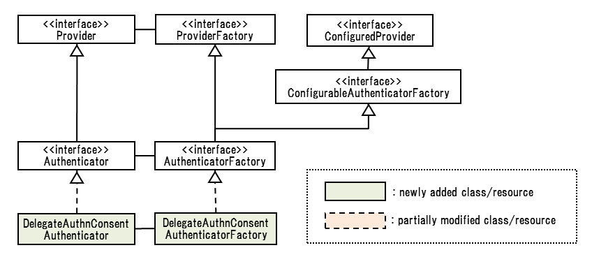
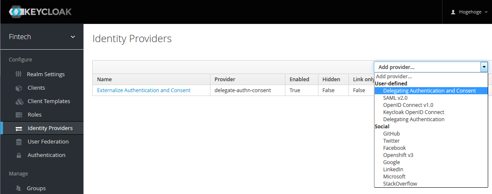
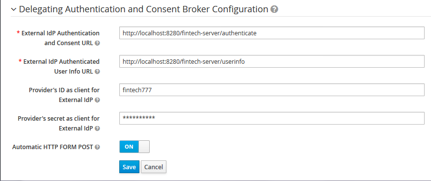
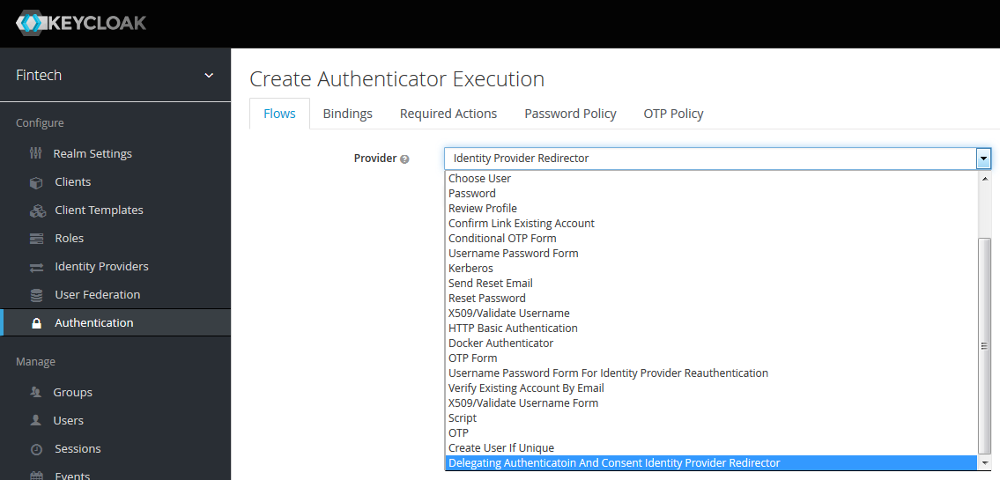
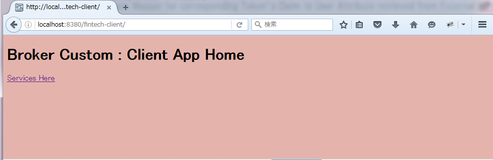
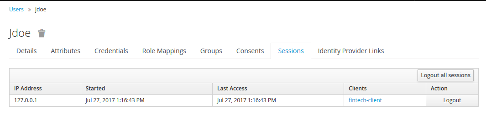
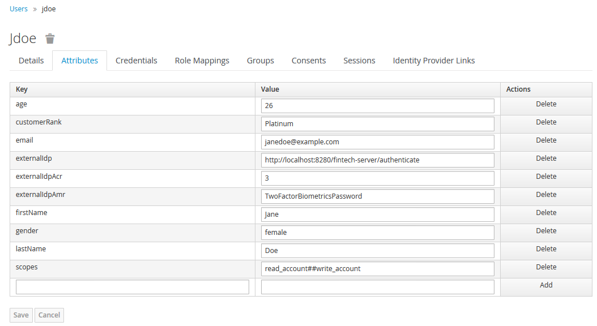

Authentication Delegation Mechanism Design Memo Takashi Norimatsu(@tnorimat), Hitachi,Ltd.
===

# 1. Preface
This memo describes Delegating Authentication and Authorization by Identity Brokering with custom providers.
In this memo, the terms defined in [NIST SP 800-63C] are used.

## 1.1. Reference
[NIST SP 800-63C] [DRAFT NIST Special Publication Digital Identity Guidelines 800-63C Federation and Assertion](https://pages.nist.gov/800-63-3/sp800-63c.html "DRAFT NIST Special Publication Digital Identity Guidelines 800-63C Federation and Assertion")

[keycloak] [Keycloak Server Administration Guide](https://keycloak.gitbooks.io/documentation/server_admin/index.html)

[SAMLv2] [Security Assertion Markup Language(SAML) V2.0 Technical Overview](https://www.oasis-open.org/committees/download.php/27819/sstc-saml-tech-overview-2.0-cd-02.pdf)

[TokenBind] [The Token Binding Protocol Version 1.0](https://tools.ietf.org/html/draft-ietf-tokbind-protocol-14)

[SAMLv2HoKA] [SAML V2.0 Holder-of-Key Assertion Profile Version 1.0 Committee Specification 02](http://docs.oasis-open.org/security/saml/Post2.0/sstc-saml2-holder-of-key-cs-02.pdf)

[SAMLv2HoKSSO] [SAML V2.0 Holder-of-Key Web Browser SSO Profile Version 1.0 Committee Specification 02](http://docs.oasis-open.org/security/saml/Post2.0/sstc-saml-holder-of-key-browser-sso-cs-02.pdf)

[PKCE] [RFC 7636 Proof Key for Code Exchange by OAuth Public Clients](https://tools.ietf.org/html/rfc7636)

[OWASP] [Session Management Cheat Sheet](https://www.owasp.org/index.php/Session_Management_Cheat_Sheet)

## 1.2. About Delegating Authentication and Authorization
In this context, Delegating Authentication and Authorization stands for delegating authentication and authorization to an external server (call it External IdP subsequently) on behalf of keycloak's browser-based authentication mechanism. It might be said that it be the variant of Identity Brokering mentioned in section 3.13 of [keycloak] except for the following points.
- Not using standard protocols for Identity Federation such as OpenID Connect and SAMLv2. But its concept is similar to 5.1.3 SP-Initiated SSO: POST/Artifact Bindings of [SAMLv2].
- Authorization is also delegated. 

## 1.3. Current Status
Prototype Implementation and PoV testing has been completed.

## 1.4. Implementation Concept
Realizing this feature by Identity Brokering with implementing custom providers whose roles are as follows.
- Identity Provider : Conduct Identity Brokering in non-standard protocol.
- Identity Provider Redirector : Keep and convey client's parameters to an external IdP generating customized pages depending on these parameters.

Why using customized Identity Provider Redirector is as follows.

If you want to only externalize authentication, it is adequate to only customize Identity Provider. However, if you want to also externalize authorization, it is necessary to keep temporarily some parameters (ex. scope, client_id) passed from a client in HTTP request to keycloak, and hand them over Identity Provider, finally propageting them to the External IdP. 

## 1.5. Keycloak Version
3.2.0.Final is used.

# 2. Motivation
- The external IdP providing authentication and authorization has already existed.
- This external IdP has not implemented OpenID Connect protocol.
- You want to use keycloak for realizing secure identity and access management by OpenID Connect.

In this situation above, you could opt to port the authentication and authorization feature of the existing external IdP onto keycloak, or implement OpenID Connect protocol on it.

However, the followings make the former hard or impossible. 

- UI implementation cost : Responsive design, vast amount of customization based on various factors.
- Porting cost for Authenticaiton : Requirements for high-level authentication that have already been implemented in the existing IdP such as multi-factor authentication for LoA 3 conformance in ITU-T X.1254.

The latter is also impractical due to difficulty and cost for implementing newly OpenID Connect by yourself.

This Delegating Authentication and Authorization mechanism resolves these difficulties by using the existing external IdP and retrieving authenticated user's information and his/her consent by Back-channel communication between keycloak and this external IdP

## 3. Sequence
Below shows the sequense of Delegating Authentication and Authorization.

1. On a user's browser accessing some resources of a client protected by keycloak, the client redirect the user's browser to keycloak's authorization endpoint, starting OIDC's authorization code flow.

2. Keycloak invokes Identity Brokering. It redirects the user's browser to an endpoint of this custom identity provider as a default without the user's intervention.

3. On the user's browser accessing the endpoint of the custom identity provider, keycloak redirects the user's browser to an external IdP.

4. After the user completing authentication and authorization on the external IdP, the external IdP redirects the user's browser to the endpoint of the custom identity provider with an artifact.

5. On accessing the endpoint of the custom identity provider, keycloak sends the external IdP received artifact and retrieves the authenticated user's information and his/her granting consent via backchannel communication.

6. The custom identity provider conducts Identity Federation that corresponds keycloak's user representation and that of the external IdP by mapping attributes and roles between them.

7. The rest of this sequence is the same as Identity Brokering in OIDC's authorization code flow.

<center>Fig.1 The sequence of Delegating Authentication and Authorization based on Identity Brokering</img></center>

## 4. Requirements on External IdP
- After conducting authentication and authorization, issue an artifact, bind it with the authenticated end user's information and his/her authorized consent, and send this artifact back to keycloak by the end user's browser.
- On receiving the artifact from keycloak, return the authenticated end user's information and his/her authorized consent binded with this artifact.
- This information is JSON formatted and MUST include non null and unique "userid" and "username" fields. These fields' value are used by keycloak to conduct Identity Federation.

As for security issues on these requirements, please see 7. Security Consideration.

## 5. Class Design

The class design is the following.

### 5.1. Identity Provider

<center>
Fig.2 Custom Identity Provider classes</img></center>

- DelegateAuthnIdentityProvider : Only externalizing authentication.
- DelegateAuthnConsentIdentityProvider : Both externalizing authentication and authorizaion.

### 5.2. Identity Provider Redirector

<center>
Fig.3 Custom Identity Provider Redirector classes</img></center>

- DelegateAuthnConsentAuthenticator: Both externalizing authentication and authorizaion.

## 6. PoV Trial
This section shows the result of PoV trial.

### 6.1. Preparation

Project Directory :

* /examples/providers/delegate-authn-consent

Provider :

* /target/delegate-authn-consent-example.jar

FreeMarker Template Files :

* /src/main/resources/theme/base/admin/resources/partials/realm-identity-provider-delegate-authn.html
* /src/main/resources/theme/base/admin/resources/partials/realm-identity-provider-delegate-authn-consent.html

Message Properties :

* /src/main/resources/theme/base/admin/messages/admin-messages_en.properties
* /src/main/resources-community/theme/base/admin/messages/admin-messages_ja.properties

Before booting keycloak, 
* Deploy Provider (ex. put it onto /providers)
* Set FreeMarker Templete Files
   put realm-identity-provider-delegate-authn.html onto /theme/base/admin/resources/partials
   put realm-identity-provider-delegate-authn-consent.html onto /theme/base/admin/resources/partials
* Set Message Properties
   put admin-messages_en.properties onto /theme/base/admin/messages
   put admin-messages_ja.properties onto /theme/base/admin/messages

### 6.2. Realm

#### 6.2.1. Create Realm
After login Master realm, create an realm. In this document, create it as “fintech”.

#### 6.2.2. Create Realm Specific Admin User
After login Master realm, create an user who can play as an administrator for only “fintech” realm. In this document, create it as “fintech-admin” and assign appropriate roles for an administrator in Role Mappings – Client Roles.

NOTES: According to Keycloak’s manual (https://keycloak.gitbooks.io/documentation/server_admin/topics/admin-console-permissions/per-realm.html#_per_realm_admin_permissions), we could use Dedicated Realm Admin Console. But we does NOT use it
Because we use Identity Brokering as Browser Login Flow so that if a realm dedicated admin user tried to access this realm, he/she would be redirected to the External IdP.

#### 6.2.3. Create Client and Resource Server
After login Master realm, create clients. In this document, create Client as “fintech-client” and Resource Server as “res-server-virgo”

#### 6.2.4. Add Custom Identity Provider
Add Custom Identity Provider. “Identity Providers” -> “Add provider...” -> “User-defined” -> “Delegating Authentication and Consent”
In this context, add it whose name is “Externalize Authentication and Consent”.

<center>
Fig.4 Add Identity Provider</img></center>

#### 6.2.5. Set Up Custom Identity Provider Mapper
This settings consists of two parts. The first half is common settings among other providers while the last half is provider specific settings. Here shows the common settings.

* “Enabled” should be ON. Other switches should be OFF.
* “GUI order” should be blank.
* “First Login Flow” should be “first broker login”.
* “Post Login Flow” should be blank. (There is nothing to do in this flow)

Here shows the provider specific setting.

<center>
Fig.5 Identity Provider Settings</img></center>

- External IdP Authentication and Consent URL: URI for External IdP’s Authentication and Consent Form Page. In this document, it refers to “External IdP Endpoint” in Fig.1 Sequence Diagram.
- External IdP Authenticated User Info URL: URI for retrieving autenticated user’s information on External IdP In this document, it refers to “Userinfo Endpoint” in Fig.1 Sequence Diagram.
- Provider’s ID as client for External IdP: ID for Client Basic Authentication by External IdP.
- Provider’s secret as client for External IdP: password for Client Basic Authentication by External IdP.
- Automatic HTTP FORM POST: If ON, send the page including parameters transmitted to External IdP by javascript instead of 302(307) redirect.

#### 6.2.6 Set Up Custom Identity Provider Mapper
By the same manner in OIDC/OAuth2 Identity Provider Mapper, we can create Attribute Mapper and Realm/Client Role Mapper.

NOTES: As for Attribute Mapper, this map a field in JSON formatted user information onto keycloak’s internal user information model (UserModel). If you want to put it also onto tokens, you need to set up Attribute Mapper in Client settings.

#### 6.2.7. Set Up First Broker Login Flow
To conduct First Broker Login Flow without an end user’s intervention, set up this flow as follows.

* “Create User If Unique” should be REQUIRED.

* Other flows and executions should be DISABLED

#### 6.2.8. Set Up Browser Based Authentication Flow
To automatically redirect to External IdP, you need to create(copy and modify) browser based authentication for this purpose.

At first, copy the defalut browser based authentication flow. In this document, this custom browser based authentication is named as “Authn Consent Delegate Redirector”.

##### 6.2.8.1. Set Up Identity Provider Redirector
Add execution named
 “Delegating Authentication And Consent Identity Provider Redirector” to the flow just created.
It keeps the client parameters which are used by External IdP to generate HTML pages dynamically, and redirect the custom identity provider with no end user intervention.

<center>
Fig.6 Add Identity Provider Redirector</img></center>

After add the execution “Delegating Authentication And Consent Identity Provider Redirector”, set up this execution.
In its Configuration, you can specify header fields (up to 5) and query parameters (also up to 5) which are used by External IdP to generate HTML pages dynamically.

For example, specifying “client_id” and “scope”, External IdP can determine which consent to be granted by an end user and customize HTML pages.

<center>

Fig.7 Identity Broker Redirector Settings</img></center>

##### 6.2.8.2. Set Up Execution Order and Requirement
To redirect the custom identity provider automatically, you need to set up order and “Requirement” setting of each execution in the custom browser based authentication flow you’ve already created.

* Move the custom execution you’ve created onto the top order.
* Set “Requirement” as “ALTERNATIVE” of this custom execution.
* Set “Requirement” as “DISABLED” of all executions except this custom execution. 

<center>

Fig.8 Browser Based Flow Settings</img></center>

##### 6.2.8.2. Set Up Flow Bindings
To redirect the custom identity provider automatically, you need to make the custom browser based flow effective.
* On “Authentication” -> “Bindings”, set Browser Flow to “Authn Consent Delegate Redirector” that you’ve created

<center>

Fig.9 Browser Based Flow Binding Settings</img></center>

#### 6.2.9. Create Realm and Client Roles
Create realm roles and client roles that is mapped onto the authenticated user's information and his/her authorized consent.

#### 6.2.10 Set Up Client’s Mapper (Attribute/Role)
Create Mapper for corresponding Token’s Claim to User Attribute retrieved from External IdP and federated.


## 6.3. PoV Test

Open the Client Application and access protected resource by keycloak.

<center>

Fig.10 Client Application before login</img></center>

By Identity Brokering, redirected to the External IdP.

<center>

Fig.11 External IdP</img></center>

After authentication and authorization, redirected to the Client Application. By Identity Provider Redirector, some parameters of Client Application are propagated onto the External IdP.

<center>

Fig.12 External IdP</img></center>

The external IdP returns such the authenticated user's information and his/her authorized consent in return for an artifact issued to the keycloak's Identity Provider.

The authenticated user's information and his/her authorized consent is JSON formatted as follows.

```json
{
 "userid":"janedoe.at.example.com",
 "username":"jdoe",
 "firstName":"Jane",
 "lastName":"Doe",
 "email":"janedoe@example.com",
 "gender":"female",
 "age":"26",
 "externalIdp":"http://localhost:8280/fintech-server/authenticate",
 "externalIdpAcr":"3",
 "externalIdpAmr":"TwoFactorBiometricsPassword",
 "customerRank":"Platinum",
 "scopes":["read_account","write_account"]
}
```
scopes stands for granted permissions by the end user's consent.

On keycloak's management console, confirm the new session is created.

<center>

Fig.13 Sessions on keycloak's management console</img></center>

Also, Identity Provider Link is also created.

<center>

Fig.14 Identity Provider Link on keycloak's management console</img></center>

As a result of Identity Federation, the user's attribuites and roles are the followings.


<center>

Fig.15 User's Attributes on keycloak's management console</img></center>

<center>

Fig.16 User's Roles on keycloak's management console</img></center>

After Identity Federation, keycloak returns such the Access Token to the client as follows.

```json
{
 "jti":"011cef7a-55a2-480a-a720-32c86ea75950",
 "exp":1501129947,
 "nbf":0,"iat":1501129647,
 "iss":"http://localhost:8080/auth/realms/fintech",
 "aud":"fintech-client",
 "sub":"d80fea54-c1da-4097-9ee1-20ca4a937834",
 "typ":"Bearer",
 "azp":"fintech-client",
 "auth_time":1501129647,
 "session_state":"3028f752-524f-4965-bf25-681ebeadce57",
 "acr":"1",
 "allowed-origins":[],
 "realm_access":{"roles":["read_account","user"]},
 "resource_access":{"res-server-virgo":{"roles":["write_account_on_virgo"]}},
 "firstName":"Jane",
 "lastName":"Doe",
 "customerRank":"Platinum",
 "gender":"female",
 "externalIdpAmr":"TwoFactorBiometricsPassword",
 "preferred_username":"jdoe",
 "scopes":["read_account","write_account"],
 "externalIdpAcr":"3",
 "email":"janedoe@example.com",
 "age":"26",
 "externalIdp":"http://localhost:8280/fintech-server/authenticate"

}
```

## 7. Security Consideration

I've consider them based on 6.1. Back-channel Presentation and 8. Security of [NIST SP 800-63C].

### 7.1. Assertion
In general, there seemed to be nothing special because the authenticated end user's information and his/her authorized consent are transmitted in Back Channel in the private network.

### 7.1.1. Assertion Manufacture/Modification
+ Both keycloak's and the external IdP's endpoints in Back Channel MUST be within the **same private** network so that no entity outside this network can access them, and mutually authenticated TLS connections SHOULD be used if necessary.

### 7.1.2. Assertion Disclosure
same as 7.1.1.

### 7.1.3. Assertion Redirect
same as 7.1.1.

### 7.1.4. Assertion Substitution
+ Keycloak and the external IdP MUST be controlled by the same organization.

### 7.1.5. Assertion Repudiation
same as 7.1.4.

### 7.1.6. Assertion Reuse
same as 7.1.4.

### 7.2. Secondary Authenticator
+ The external IdP MUST treat uses cases using secondary authenticator.

### 7.3. Assertion Reference 
In general, there seemed to take extra precaution because artifacts are transmitted in Front Channel via user's browser in the Internet.

### 7.3.1. Assertion Reference Manufacture/Modification
+ Both keycloak's and the external authentication server's endpoints in Front Channel MUST NOT accept HTTP connection but MUST only accept HTTPS connections. It might be treated by keycloak's realm settings ("Login" -> "Require SSL" -> all requests ).
+ An artifact MUST NOT contain any information about an authenticated user and MUST be created with at least 256 bits of entropy.  

### 7.3.2. Assertion Reference Disclosure
+ same as the first item mentioned in 7.3.1.
+ an artifact MUST NOT be carried as query string and fragment of URI 

### 7.3.3. Assertion Reference Redirect
+ Redirection URI to which an artifact is conveyed MUST be specified by the external IdP.

### 7.3.4. Assertion Reference Substitution
Besides assertion reference, if an attacker intercepts a victim's login session information (aka code issued by keycloak's endpoint in Front Channel) and the assertion reference, the attacker impersonate the victim by accessing keycloak's login endpoint in Front Channel with victim's session information(code) and assertion reference.

In order to prevent this impersonation, several methods are developed.
1. Token Binding using TLS layer's exported keying material derived from its master secret mentioned in [TokenBind]
2. Holder of Key Assertion mentioned in [SAMLv2HoKA] [SAMLv2HoKSSO]
3. Proof Key for Code Exchange mentioned in [PKCE]
4. Session ID in Cookie, header parameter mentioned in [OWASP]

Apart from 1, if the attacker intercepts messages between the victim's browser and keycloak, and between victim's browser and the external authentication server, the attacker has a chance to impersonate the victim. Therefore, communications among them MUST be protected by TLS which makes the attacker given little chance to intercept messages (but not perfect if considering MITM, compromising user's browser and machine, et al.).

As for 1, it is preferable but I couldn't find any implementation that might be used.

As for 2, it might be difficult to use and manage client side X.509 certificates even if these need not trusted certificates. Moreover, it seems not to specify how to prove possesion of the private key corresponding to the public key bound to the certificates in detail.

As for 3, it might be difficult to make the browser conduct this protocol without modifying the browser itself (might be possible if using JavaScript sent from keycloak).

Therefore, I chose 4 and use HTTP FORM POST with assertion reference enclosed in its message's body, but not yet determine whether using cookie or header parameter for Session ID.

In keycloak, code issued from login endpoint in Front Channel would be used as session id, but I did not use it as Session ID because keycloak's default login endpoint only accept code (and execution) in the form of query parameters, which might not be secure because query parameters are disclosed in the browser, the http/proxy server's log and so on.

### 7.3.5. Assertion Reference Reuse
Those below are about the External IdP matters so that keycloak cannot deals with them.
+ An artifact MUST be available in a short time such as 30 seconds (might be enough long to complete artifact resolution because of what mentioned in 7.1.1. and 7.1.4.).
+ An artifact MUST be used once and for all.

### 7.3.6. Assertion Reference Repudiation
same as 7.1.4.
